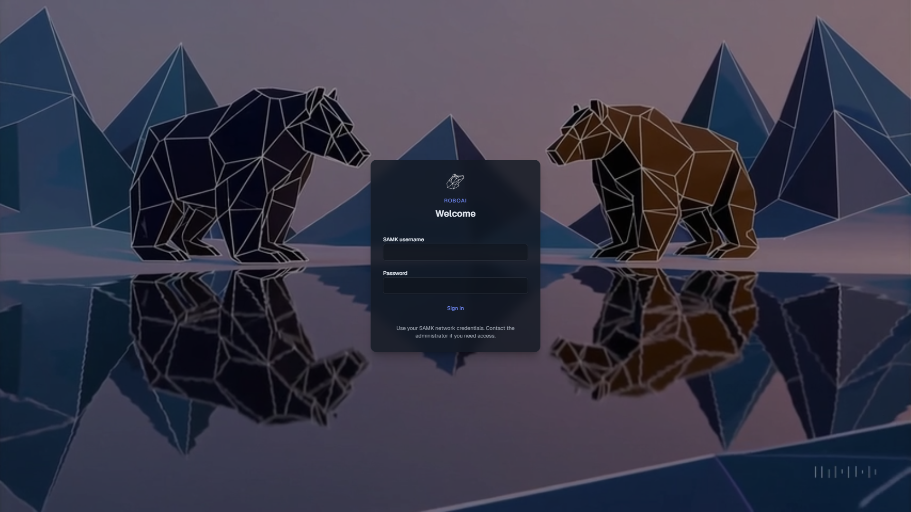
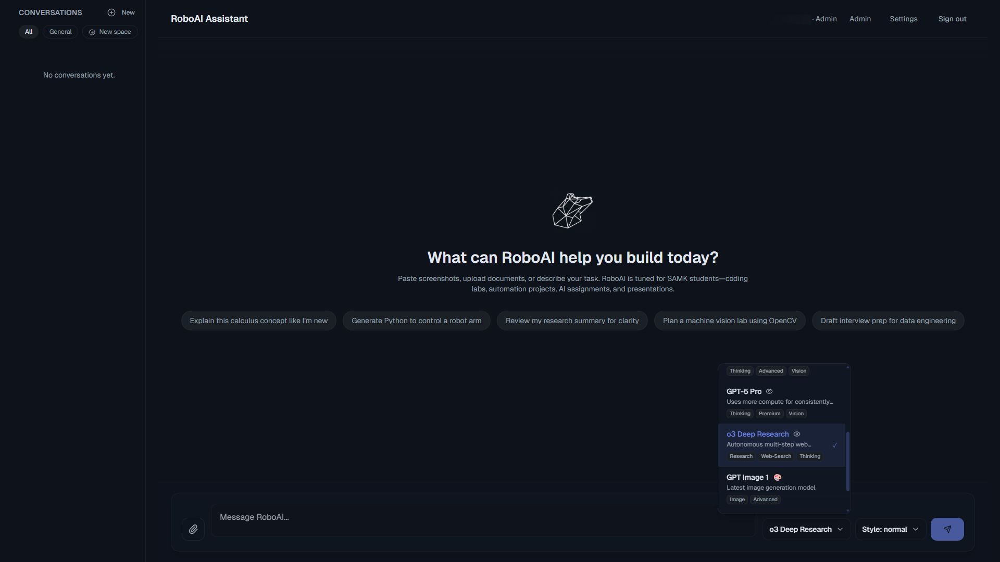
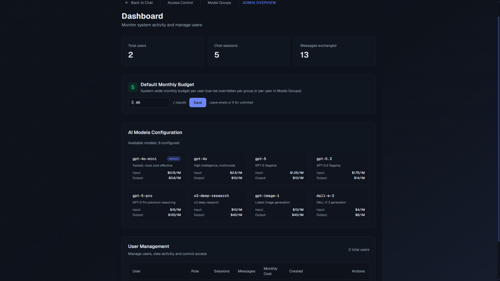
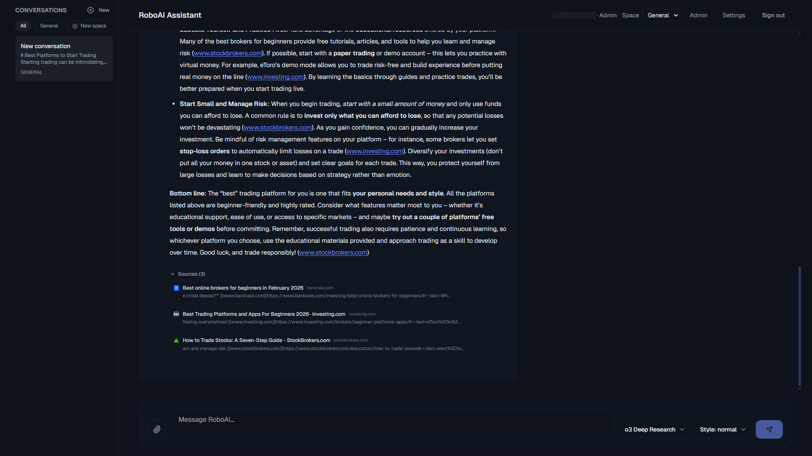
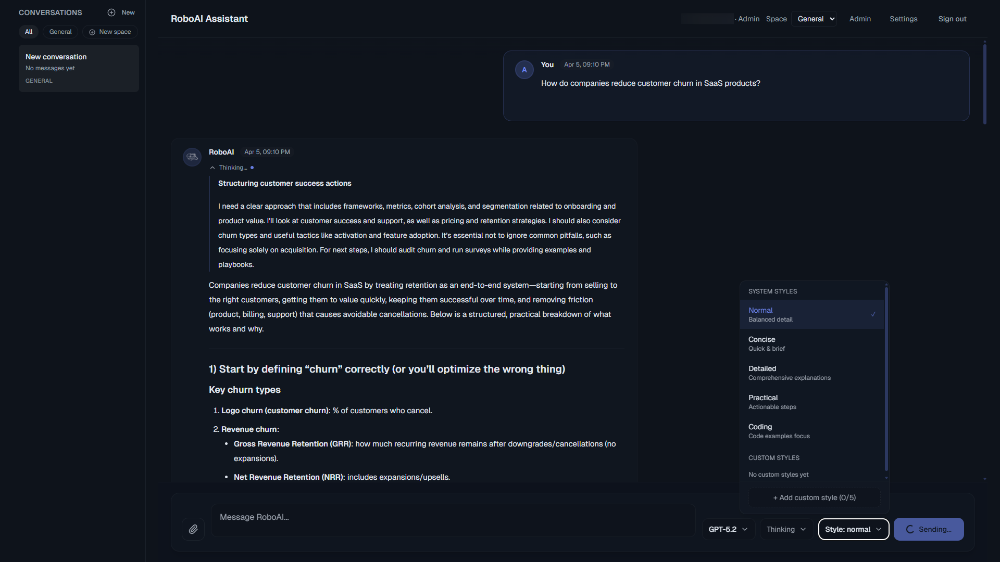
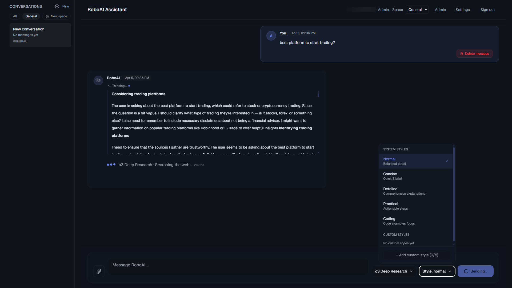
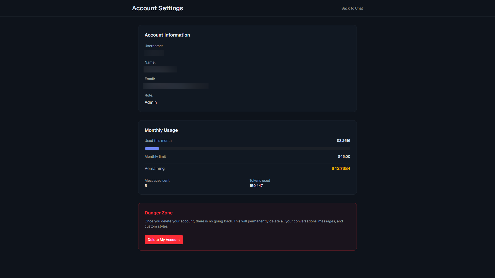
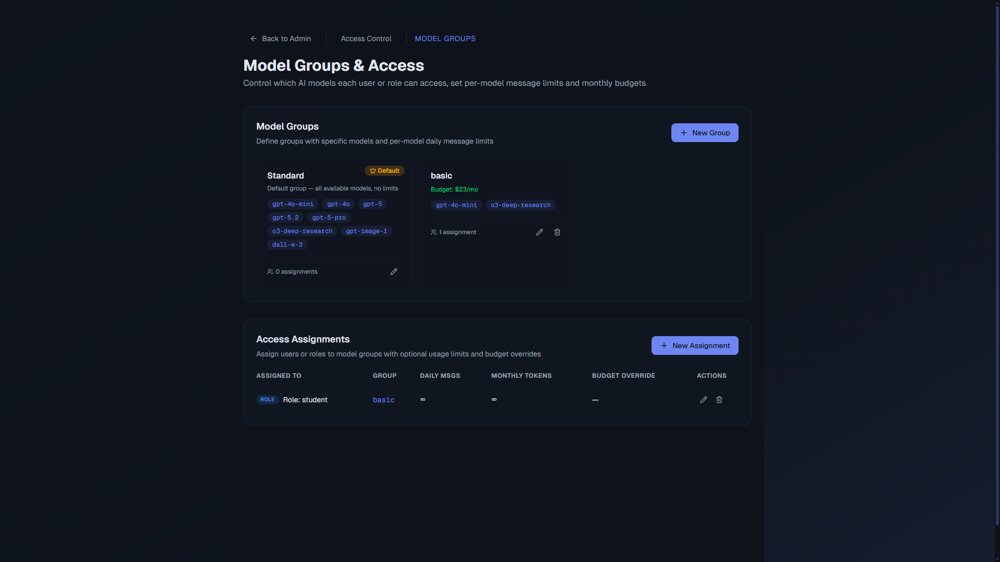
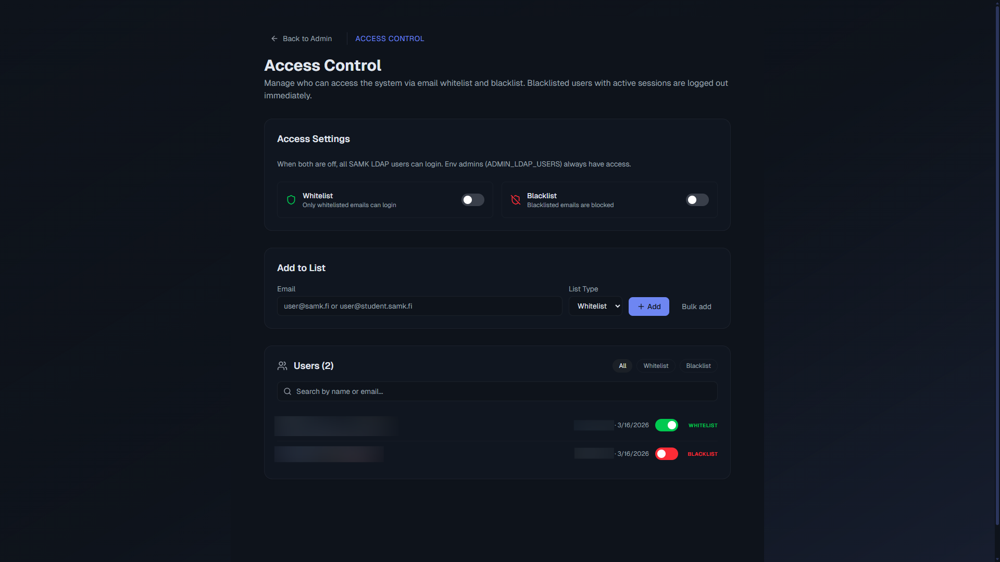

# AI Platform - Enterprise Multi-Model Chat System

> **Enterprise multi-model AI platform** | Built for SAMK University | Solo Developed

[](https://nextjs.org/)
[](https://reactjs.org/)
[](https://www.typescriptlang.org/)
[](https://openai.com/)
[](https://www.prisma.io/)

<div align="center">
  
  <br/><br/>
  
  <br/><br/>
  
</div>

<details>
<summary>📸 <b>Click to view more platform screenshots</b></summary>

<br/>

### Deep Research & Citations
<div align="center">
  
  <p><em>o3 Deep Research generating cited answers with live web sources</em></p>
</div>
<br/>

### Chat & Reasoning Models
<div align="center">
  
  
</div>
<br/>

### User Settings & Personalization
<div align="center">
  
  <p><em>Account info, monthly usage tracking, budget limits, and GDPR account deletion</em></p>
</div>
<br/>

### Model Groups & Access Management
<div align="center">
  
</div>
<br/>
<div align="center">
  
  <p><em>Fine-grained access control: Model Groups with budget caps, and user whitelisting/blacklisting</em></p>
</div>

</details>

---

## 🎯 Project Overview

An enterprise-grade AI chat platform demonstrating **sophisticated architecture**, **multi-model integration**, and **production-ready engineering**. Built as a cost-effective alternative to commercial ChatGPT licensing for a university staff pilot program.

### Key Achievements

🚀 **8 AI Models Integrated Across 4 Families**
- GPT-4 family (GPT-4o, GPT-4o-mini)
- GPT-5 reasoning series (GPT-5, GPT-5.2, GPT-5 Pro)
- Deep Research (o3-deep-research with live web search & citations)
- Image generation (DALL-E 3, GPT Image 1)

💰 **~88% Estimated Cost Reduction**
- From: ~€23/user/month (ChatGPT Pro licensing)
- To: ~€2.70/user/month estimated (usage-based OpenAI API)
- Projected savings: ~€13,100/year for 60 users (pending full pilot validation)

⚡ **Advanced Features**
- Responses API architecture (all chat models use Responses API)
- 4-mode system per model (auto/instant/thinking/pro)
- Real-time streaming with Server-Sent Events
- Enterprise LDAP authentication (via `ldapts`)
- Dynamic Model Groups with budget controls & user access overrides
- Hard Whitelist/Blacklist access control
- Deep Research with automated citation rendering
- KaTeX math rendering, streaming timer, and rich markdown

🏢 **Production Deployed**
- Running on SAMK University infrastructure (Docker + PostgreSQL)
- Active staff pilot program with growing user base
- Solo developed end-to-end

---

## 📊 Business Impact

### Problem
SAMK University needed AI chat capabilities for staff, facing:
- **Fixed licensing costs**: ~€23/user (ChatGPT Pro) or ~€30-60/user (Enterprise)
- **Budget waste**: Light users subsidize heavy users
- **No cost visibility**: Can't track or optimize usage
- **Scalability concerns**: Linear cost growth per user

### Solution
Custom AI platform with:
- **Usage-based pricing**: Pay only for actual API calls
- **Multi-model support**: 8 models for different use cases and budgets
- **Enterprise integration**: University LDAP authentication
- **Cost transparency**: Real-time usage tracking and analytics

### Estimated Results

| Metric | Before | After (Est.) | Improvement |
|--------|--------|-------|-------------|
| **Cost (60 users)** | ~€1,380/month | ~€162/month | **~88% reduction** |
| **Model options** | 1 (whatever model comes with the plan, no choice) | 8 models via API (add any model you want) | **Full flexibility** |
| **Cost visibility** | None | Real-time | **Full transparency** |
| **Scalability** | Linear | Usage-based | **Optimal** |

> **Note**: All financial figures are estimates based on projected usage patterns. Actual costs depend on real pilot program data.

**Estimated ROI**: Break-even in <1 month | Projected Year 1 savings: ~€13,100

---

## 🏗️ Architecture Highlights

### Model Catalog

```
┌─────────────────┐
│  GPT-4 Family   │  GPT-4o-mini, GPT-4o
│                 │  Fast, reliable, vision-capable
└─────────────────┘

┌─────────────────┐
│  GPT-5 Series   │  GPT-5, GPT-5.2, GPT-5 Pro
│  Reasoning      │  Flagship reasoning with verbosity control
└─────────────────┘

┌─────────────────┐
│  Deep Research  │  o3-deep-research
│                 │  Autonomous web research with citations
└─────────────────┘

┌─────────────────┐
│  Image Gen      │  DALL-E 3, GPT Image 1
│                 │  High-quality image generation
└─────────────────┘
```

### API Integration

The platform routes all models through **two OpenAI API backends**:

1. **Responses API** — All chat and reasoning models (GPT-4o-mini, GPT-4o, GPT-5, GPT-5.2, GPT-5 Pro, o3-deep-research)
2. **Images API** — Image generation models (DALL-E 3, GPT Image 1)

**Fallback Strategy**: When GPT-5 streaming fails (organization not verified), automatically falls back to non-streaming mode.

### Tech Stack

**Frontend**:
- Next.js 15.1.7 (App Router) + React 19.1.0
- TypeScript for full type safety
- Tailwind CSS 4 + Framer Motion
- React Markdown + Prism.js + KaTeX for rich rendering

**Backend**:
- Next.js Route Handlers (serverless)
- Prisma ORM (Dockerized PostgreSQL)
- NextAuth.js for session management
- LDAP integration via `ldapts` for university SSO

**AI Integration**:
- OpenAI SDK 5.23 with streaming support
- Responses API + Images API
- Token counting and cost calculation
- Deep Research tool integration (`web_search_preview`)

**Database**:
- 10 Prisma models (User, ChatSession, Message, Attachment, UsageStats, CustomStyle, ModelGroup, UserModelAccess, UserAccessList, SystemSetting)
- Message encryption at rest (dual IV: `iv` + `reasoningIv`)
- GDPR-compliant schema with cascade deletes
- Per-user, per-day, per-model usage tracking

---

## ✨ Feature Showcase

### 1. Multi-Model Selection

Users choose from 8 AI models grouped by capability via a searchable model selector UI:

```typescript
// Active models (from config.ts CONFIGURED_MODELS)
gpt-4o-mini      $0.15/$0.60 per 1M tokens     // Fast, cost-effective
gpt-4o           $2.50/$10.00 per 1M tokens     // High-intelligence

gpt-5            $1.25/$10.00 + $10 reasoning   // Flagship reasoning
gpt-5.2          $1.75/$14.00 + $14 reasoning   // Latest flagship
gpt-5-pro        $15.00/$120.00 + $120 reasoning // Premium compute

o3-deep-research $10.00/$40.00 + $40 reasoning  // Autonomous web research

gpt-image-1      $10.00/$40.00                  // Latest image generation
dall-e-3         $4.00/$8.00                     // High-quality images
```


### 2. Advanced Mode System

Models supporting mode picker (GPT-5, GPT-5.2) adjust runtime parameters dynamically:

- **Auto**: Balanced reasoning and token limit (default)
- **Instant**: Fast responses, lower token allowance
- **Thinking**: Deep reasoning, higher token budget
- **Pro**: Maximum capabilities, premium settings (up to 128k output tokens)

Example configuration for GPT-4o (from `config.ts`):
```typescript
modes: {
  auto: { temperature: 0.65, topP: 1, maxOutputTokens: 4096 },
  instant: { temperature: 0.35, topP: 0.85, maxOutputTokens: 2048 },
  thinking: { temperature: 0.6, topP: 1, maxOutputTokens: 6144 },
  pro: { temperature: 0.2, topP: 0.8, maxOutputTokens: 6144 },
}
```

### 3. Deep Research & Citations

The `o3-deep-research` model performs autonomous multi-step web research:
- Live web access via `web_search_preview` tool integration
- Automated citation extraction and inline rendering
- Streaming timer showing research duration
- Up to 100k generated content per query

### 4. Image Generation

Fully implemented with 2 models:

**Features**:
- Size selection (1024x1024, 1024x1536, 1536x1024)
- Quality levels: low/medium/high (→ Standard/HD for DALL-E 3)
- Safety filtering: Automatic content rewrites for policy compliance
- Server storage: Generated images saved to `uploads/generated/`
- Chat integration: Images returned as message attachments

### 5. Real-Time Streaming

Server-Sent Events (SSE) for token-by-token delivery:

```typescript
// Streaming implementation
const stream = await openai.responses.stream({
  model: 'gpt-4o',
  input: conversationHistory,
  stream: true,
});

for await (const event of stream) {
  if (event.type === 'response.output_text.delta') {
    controller.enqueue(`data: ${JSON.stringify({ text: event.delta })}\\n\\n`);
  }
}
```

### 6. Enterprise Authentication

**LDAP Integration** (via `ldapts`):
- University Active Directory SSO
- Auto-provision users on first login
- No local password storage
- Role derivation from LDAP groups (student/staff/admin)
- Configurable timeout and TLS settings

**Session Security**:
- JWT-based sessions via NextAuth
- HTTP-only, SameSite cookies
- Automatic session rotation

### 7. Dynamic Access Control & Model Groups

**Model Groups**:
- Logically combine models (e.g., "Expensive Models", "Image Creators")
- Assign access based on role (student, staff, admin) or specific user
- Set monthly budget caps per group in cents

**User Access Control**:
- Hard Whitelist/Blacklist by email
- Per-user daily message limits and budget overrides
- Role-wide defaults with individual exceptions

### 8. Rate Limiting & Cost Control

**Implementation** (via ModelGroup + UserModelAccess):
```typescript
model UserModelAccess {
  userId                    String?
  userRole                  UserRole?
  modelGroupId              String
  dailyMessageLimit         Int?
  monthlyBudgetOverrideCents Int?
}
```

**Features**:
- Group-based budget limits (monthly cost cap in cents)
- Per-model daily limits within groups
- Per-user overrides for fine-grained control
- Real-time cost tracking (cents precision)

### 9. File Processing Pipeline

**Supported Formats**:
- **Images**: PNG, JPG, JPEG, WebP, GIF → Vision models
- **Documents**: PDF, DOCX → Text extraction → Context
- **Text**: TXT, MD → Direct inclusion

**Implementation**:
- `pdf-parse` for PDF text extraction
- `mammoth` for DOCX conversion
- 10,000 character limit per document (token cost control)
- Multi-file support (up to 5 files per message)

### 10. Admin Dashboard

**Features**:
- Platform-wide usage statistics
- Per-user token consumption
- Cost breakdown by model
- Top users by usage
- Daily/monthly trends
- GDPR-compliant (message content hidden from admin)

### 11. Custom AI Styles (System Prompts)

**User-Created Personas**:
- Create custom AI personalities with unique system prompts
- Save up to 5 custom styles per user
- Stored in database with `CustomStyle` model
- Select from dropdown when chatting
- Persistent across sessions

### 12. Professional Code Rendering

- Automatic language detection for code blocks
- Powered by `react-syntax-highlighter` with Prism
- One-click copy to clipboard
- KaTeX math rendering for equations

---

## 🛠️ Development Approach

### Core Platform

**Foundation**:
- Next.js 15.1.7 (App Router) with TypeScript strict mode
- Prisma ORM with type-safe database access (PostgreSQL)
- OpenAI SDK 5.23 with streaming support
- Modern React 19 with Server Components

**Enterprise Integration**:
- LDAP/Active Directory authentication (ldapts)
- University SSO (no password storage)
- Role-based access control
- Auto-provisioning from directory

**AI Integration**:
- 8 model support across 4 families
- Responses API + Images API architecture
- Real-time streaming with SSE
- Cost tracking per token

**Production Features**:
- File processing (PDF/DOCX/images)
- Usage analytics dashboard
- Dynamic Model Groups with budget controls
- GDPR-compliant schema with encryption at rest

---

## 📁 Documentation

### Core Documentation

- **[Executive Summary](docs/01-executive-summary.md)** - Business case and ROI analysis
- **[Technical Architecture](docs/02-technical-architecture.md)** - System design and stack
- **[Model Catalog](docs/03-model-catalog.md)** - All 8 models documented
- **[API Architecture](docs/04-api-architecture.md)** - Responses API + Images API integration
- **[Image Generation](docs/05-image-generation.md)** - DALL-E / GPT Image implementation
- **[Enterprise Features](docs/06-enterprise-features.md)** - LDAP, access control, admin
- **[Development Timeline](docs/07-development-timeline.md)** - Iterative development journey
- **[Cost Analysis](docs/08-cost-analysis.md)** - Detailed financial comparison (estimates)
- **[Security & Compliance](docs/09-security-compliance.md)** - GDPR status, security audit
- **[Future Roadmap](docs/10-future-roadmap.md)** - n8n workflows, Moodle integration

### Diagrams

- **[System Architecture](diagrams/system-architecture.md)** - High-level system flow
- **[Dual API Flow](diagrams/dual-api-flow.md)** - Responses vs Images API
- **[Model Catalog](diagrams/model-catalog-viz.md)** - Visual model comparison
- **[Cost Comparison](diagrams/cost-comparison.md)** - Savings visualization
- **[Database Schema](diagrams/database-schema.md)** - ER diagram with relationships

### Code Examples

- **[Streaming Chat](code-examples/streaming-chat.ts)** - SSE implementation
- **[Image Generation](code-examples/image-generation.ts)** - DALL-E integration
- **[Rate Limiting](code-examples/rate-limiting.ts)** - Access control enforcement
- **[LDAP Authentication](code-examples/ldap-auth.ts)** - University SSO

---

## 🔒 Production Readiness

### Current Status: **Deployed — Staff Pilot Active**

**What's Production-Ready**:
- ✅ All 8 AI models fully integrated and operational
- ✅ Deep Research with live web search and citation rendering
- ✅ Streaming chat with SSE and streaming timer
- ✅ LDAP authentication (ldapts) working
- ✅ File upload and processing (PDF, DOCX, images)
- ✅ Usage tracking and cost calculation
- ✅ Admin dashboard with analytics
- ✅ Image generation (DALL-E 3, GPT Image 1)
- ✅ Dynamic Model Groups with budget controls
- ✅ User Whitelist/Blacklist access control
- ✅ PostgreSQL database via Docker Compose
- ✅ Message encryption at rest (GDPR)
- ✅ Right-to-Erasure cascade delete endpoints (GDPR)
- ✅ Secured Adminer database interface

**Pending for Broader Scale**:
- ⏳ Privacy policy text (pending institutional legal review)
- ⏳ Data export functionality (JSON export)
- ⏳ Session security hardening (timeout tuning)

### Security Analysis

From comprehensive security audits (**[full details](docs/09-security-compliance.md)**), critical vulnerabilities were identified and remediated:

**Remediated**:
1. **Database**: Migrated from SQLite to Dockerized PostgreSQL
2. **HTTPS**: SSL via SAMK reverse proxy
3. **DB Admin**: Secured Adminer interface
4. **UI Vulnerabilities**: Code audit findings fixed

### GDPR Compliance

**Implemented**:
- ✅ Message encryption at rest (dual IV scheme)
- ✅ Right to erasure (cascade delete endpoints)
- ✅ Data minimization (only essential data collected)
- ✅ Audit access controls (secured admin interface)

**Pending**:
- ⏳ Privacy policy publication (institutional approval needed)
- ⏳ Data export/portability endpoint

---

## 🌐 Production Deployment & Staff Pilot

**Current Status**: Platform deployed to SAMK University infrastructure, running an active staff pilot program.

**Environment**:
- Containerized deployment (Docker Compose)
- PostgreSQL database
- Secure university AI server infrastructure (on-premise)
- SSH-based CI/CD deployment workflow
- Role-based access controls (staff-only for pilot phase)

**Purpose**:
- Provide scalable, cost-effective AI resources to the university
- Reduce recurring licensing costs with usage-based pricing
- Gather feedback during pilot phase before broader rollout

**Next Steps**: Expand platform access to students following staff pilot conclusion.

---

## 🚀 Future Enhancements

### Planned Features

**n8n Workflow Automation** (est. 60-92 hours):
- Trigger workflows from chat
- Pre-built templates (email, Moodle, calendar)
- Shareable agent marketplace

**Moodle LMS Integration** (est. 42-64 hours):
- Course lookup and enrollment
- Assignment tracking and deadlines
- Grade checking
- Real-time data sync

**Local Self-Hosted Models**:
- Integration of on-premise models (e.g., Qwen, DeepSeek)
- Maximum data privacy for sensitive institutional use cases

**See [Future Roadmap](docs/10-future-roadmap.md) for detailed breakdown**

---

## 💡 Key Takeaways for Portfolio

### Technical Achievements

1. **Multi-Model Integration**: 8 AI models across 4 families including GPT-5 reasoning and deep research
2. **Responses API Architecture**: Unified API routing for chat, reasoning, and deep research models
3. **Advanced Admin Layer**: Dynamic Model Groups, budget controls, and user whitelisting/blacklisting
4. **Enterprise Patterns**: LDAP SSO (ldapts), granular rate limiting, real-time cost tracking
5. **Production Engineering**: Security audit, GDPR compliance, message encryption at rest
6. **Live Deployment**: Containerized production deployment on university infrastructure

### Business Acumen

1. **Cost Optimization**: Estimated ~88% reduction through usage-based pricing
2. **Scalability Planning**: Costs grow with usage, not user count
3. **ROI Analysis**: Estimated <1 month break-even, ~€13k projected Year 1 savings
4. **Compliance Awareness**: GDPR roadmap with encryption and erasure implemented
5. **Stakeholder Communication**: Clear value proposition to university

### Production Thinking

1. **Security First**: Comprehensive vulnerability analysis and remediation
2. **Compliance by Design**: GDPR requirements mapped and core items implemented
3. **Scalability**: Full PostgreSQL Docker stack deployed
4. **Cost Transparency**: Real-time tracking enables optimization
5. **Future-Proof**: Extensible architecture (n8n, Moodle, local models planned)

---

## 📞 Contact & Links

**Project Context**: Built for SAMK University (Finland) as a cost-effective enterprise AI platform and secure ChatGPT alternative. Solo developed end-to-end.

**Status**: Deployed to production on university infrastructure. Active staff pilot program with growing user base.

**Timeline**: September 2025 – Present

---

**Note**: This is a portfolio case study documenting a production development project. The source code is proprietary. For technical inquiries, please reach out directly.

Built by A4R5H1L | [GitHub](https://github.com/A4R5H1L)
