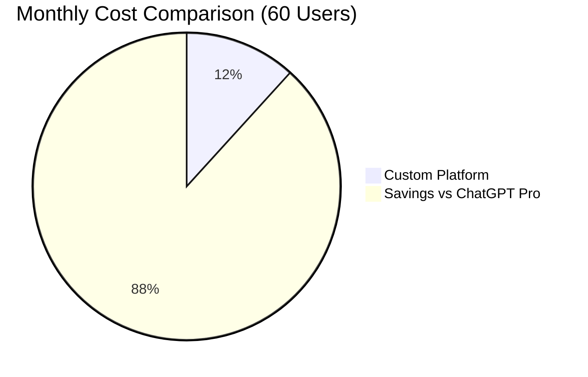
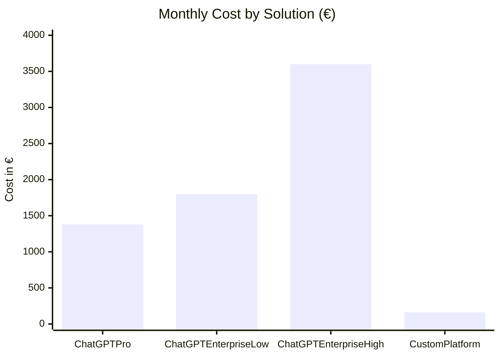
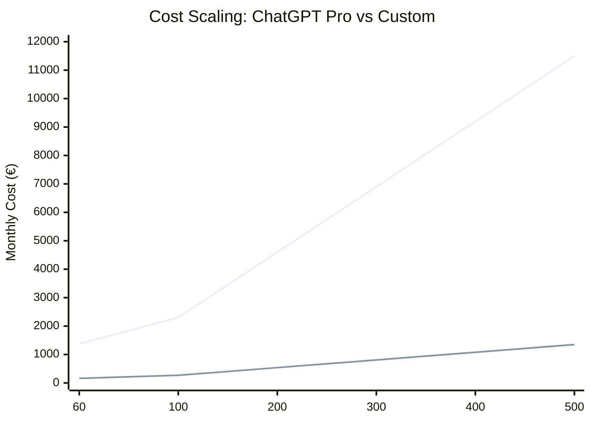
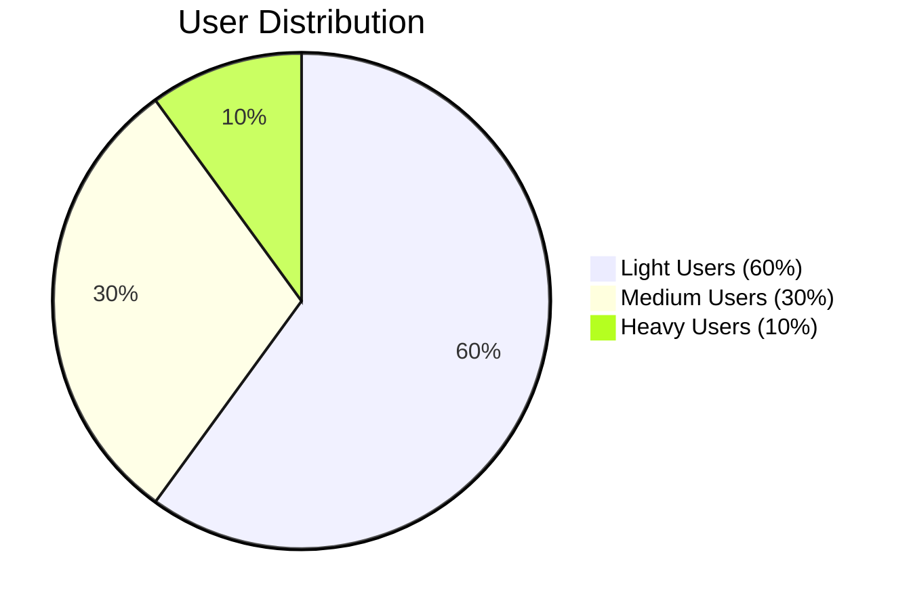
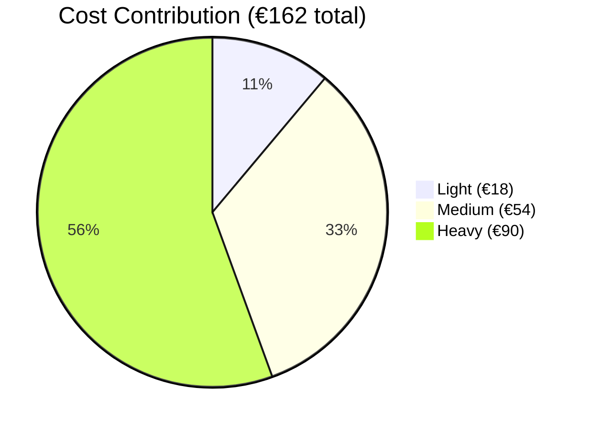

# Cost Comparison Charts

## Monthly Cost: Custom vs Commercial



## Cost Breakdown



## Scaling Analysis

### Cost at Different User Counts

| Users | ChatGPT Pro | Custom Platform | Savings |
|-------|-------------|-----------------|---------|
| 60 | €1,380 | €162 | **88%** |
| 100 | €2,300 | €270 | **88%** |
| 200 | €4,600 | €540 | **88%** |
| 500 | €11,500 | €1,350 | **88%** |



## User Segment Cost Distribution

### Usage Assumptions



### Cost Contribution by Segment



## ROI Timeline

### Year 1 Financial Summary

| Category | Amount |
|----------|--------|
| Development (one-time) | €1,000 |
| API costs (12 months) | €1,944 |
| Maintenance | €500 |
| **Total Investment** | **€3,444** |
| **Avoided Costs** | **€16,560** |
| **Net Savings** | **€13,116** |

### Break-Even Analysis

```
Month 1: -€1,000 (development) + €1,218 (savings) = +€218
Month 2: +€218 + €1,218 = +€1,436
Month 3: +€2,654
...
Month 12: +€13,116 (cumulative savings)
```

**Break-even: < 1 month**

---

## Caveats

> All figures are **estimates** based on projected usage patterns.
> Actual costs depend on pilot program validation.

### Variables That Affect Cost

**Higher Cost**:
- More heavy users
- Extensive o3/GPT-5 usage
- Large image generation volume

**Lower Cost**:
- More light users
- GPT-4o-mini dominant usage
- Effective rate limiting

---

**See Also**:
- [Cost Analysis](../docs/08-cost-analysis.md) - Detailed breakdown
- [Executive Summary](../docs/01-executive-summary.md) - Business case
