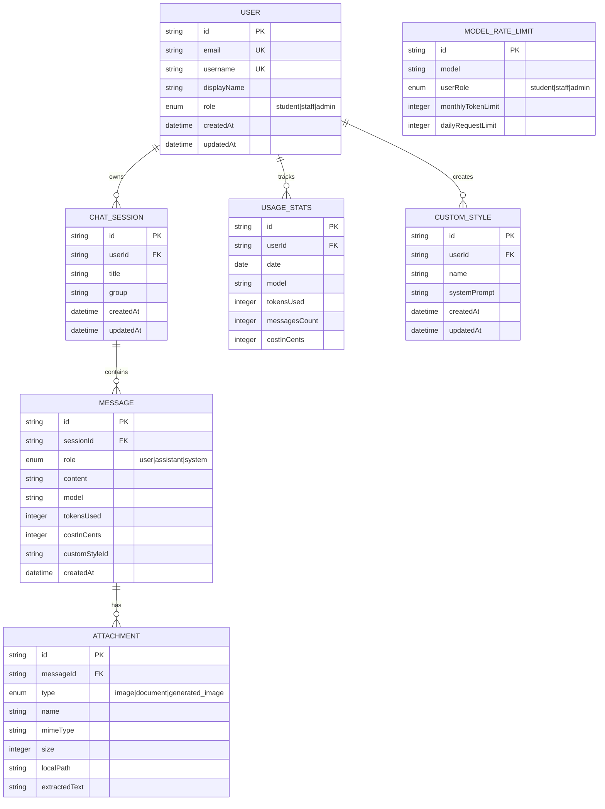

# Database Schema

## Entity Relationship Diagram



## Model Descriptions

### User
- Central identity model
- LDAP-synced (username, email, displayName)
- Role determines access and limits

### ChatSession
- Container for conversations
- Titled for reference
- Grouped for organization (optional)

### Message
- Individual messages in a conversation
- Tracks model used and cost
- Links to custom style if used

### Attachment
- Files associated with messages
- Supports images, documents, generated images
- Stores extracted text for documents

### UsageStats
- Daily aggregation per user per model
- Enables rate limiting checks
- Powers admin analytics

### CustomStyle
- User-defined AI personas
- Stored system prompts
- Per-user isolation

### ModelRateLimit
- Administrative controls
- Per-model, per-role limits
- Daily and monthly caps

## Relationships

| From | To | Relationship |
|------|-----|--------------|
| User | ChatSession | One-to-Many |
| User | UsageStats | One-to-Many |
| User | CustomStyle | One-to-Many |
| ChatSession | Message | One-to-Many |
| Message | Attachment | One-to-Many |

## GDPR Compliance

### Cascade Deletes

When a user is deleted:
- All ChatSessions deleted
- All Messages deleted (cascade from sessions)
- All Attachments deleted (cascade from messages)
- All UsageStats deleted
- All CustomStyles deleted

```prisma
model ChatSession {
  user User @relation(fields: [userId], references: [id], onDelete: Cascade)
}
```

---

**See Also**:
- [Technical Architecture](../docs/02-technical-architecture.md)
- [Enterprise Features](../docs/06-enterprise-features.md)
