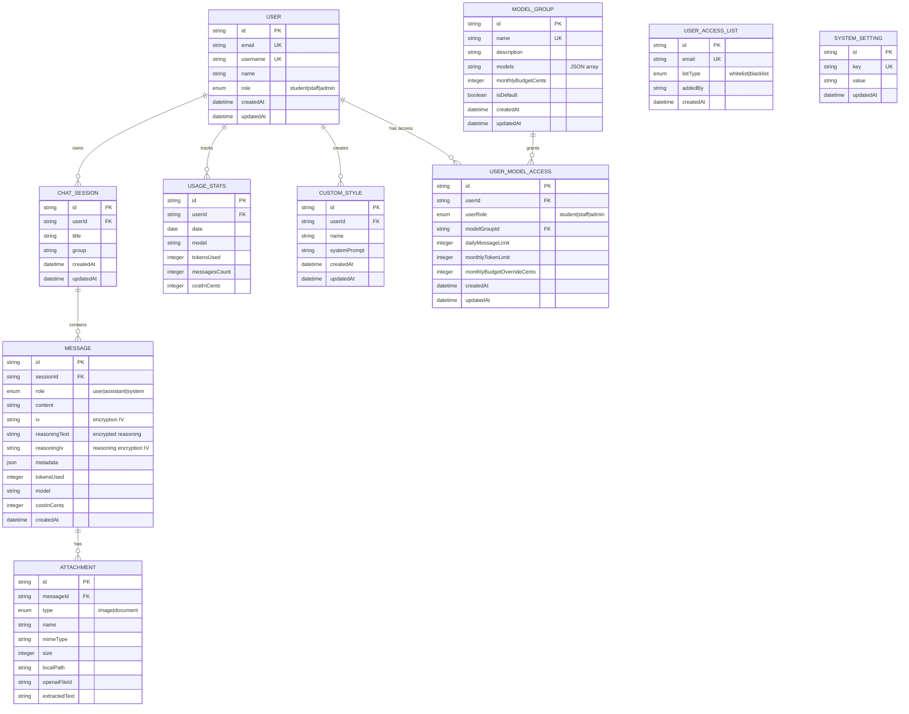

# Database Schema

## Entity Relationship Diagram

```mermaid
erDiagram
    USER ||--o{ CHAT_SESSION : owns
    USER ||--o{ USAGE_STATS : tracks
    USER ||--o{ CUSTOM_STYLE : creates
    USER ||--o{ USER_MODEL_ACCESS : "has access"
    CHAT_SESSION ||--o{ MESSAGE : contains
    MESSAGE ||--o{ ATTACHMENT : has
    MODEL_GROUP ||--o{ USER_MODEL_ACCESS : "grants"
    
    USER {
        string id PK
        string email UK
        string username UK
        string name
        enum role "student|staff|admin"
        datetime createdAt
        datetime updatedAt
    }
    
    CHAT_SESSION {
        string id PK
        string userId FK
        string title
        string group
        datetime createdAt
        datetime updatedAt
    }
    
    MESSAGE {
        string id PK
        string sessionId FK
        enum role "user|assistant|system"
        string content
        string iv "encryption IV"
        string reasoningText "encrypted reasoning"
        string reasoningIv "reasoning encryption IV"
        json metadata
        integer tokensUsed
        string model
        integer costInCents
        datetime createdAt
    }
    
    ATTACHMENT {
        string id PK
        string messageId FK
        enum type "image|document"
        string name
        string mimeType
        integer size
        string localPath
        string openaiFileId
        string extractedText
    }
    
    USAGE_STATS {
        string id PK
        string userId FK
        date date
        string model
        integer tokensUsed
        integer messagesCount
        integer costInCents
    }
    
    CUSTOM_STYLE {
        string id PK
        string userId FK
        string name
        string systemPrompt
        datetime createdAt
        datetime updatedAt
    }
    
    MODEL_GROUP {
        string id PK
        string name UK
        string description
        string models "JSON array"
        integer monthlyBudgetCents
        boolean isDefault
        datetime createdAt
        datetime updatedAt
    }
    
    USER_MODEL_ACCESS {
        string id PK
        string userId FK
        enum userRole "student|staff|admin"
        string modelGroupId FK
        integer dailyMessageLimit
        integer monthlyTokenLimit
        integer monthlyBudgetOverrideCents
        datetime createdAt
        datetime updatedAt
    }
    
    USER_ACCESS_LIST {
        string id PK
        string email UK
        enum listType "whitelist|blacklist"
        string addedBy
        datetime createdAt
    }
    
    SYSTEM_SETTING {
        string id PK
        string key UK
        string value
        datetime updatedAt
    }
```

## Model Descriptions

### User
- Central identity model
- LDAP-synced (username, email, name)
- Role determines default access and limits

### ChatSession
- Container for conversations
- Titled for reference
- Grouped for organization

### Message
- Individual messages in a conversation
- Tracks model used and cost
- Encryption fields (`iv`, `reasoningText`, `reasoningIv`) for GDPR compliance

### Attachment
- Files associated with messages
- Supports images and documents
- Stores extracted text for document context

### UsageStats
- Daily aggregation per user per model
- Enables budget enforcement
- Powers admin analytics

### CustomStyle
- User-defined AI personas
- Stored system prompts
- Per-user isolation (unique by userId + name)

### ModelGroup
- Logical grouping of models (e.g., "Expensive Models", "Image Models")
- Models stored as JSON array with optional per-model daily limits
- Monthly budget cap in cents

### UserModelAccess
- Grants access to a ModelGroup for a specific user or role
- Per-user daily message limits and budget overrides
- Unique by (userId, modelGroupId) or (userRole, modelGroupId)

### UserAccessList
- Hard whitelist/blacklist by email
- Admin-managed access control

### SystemSetting
- Dynamic key-value configuration
- Runtime-adjustable settings

## Relationships

| From | To | Relationship |
|------|-----|--------------|
| User | ChatSession | One-to-Many (cascade delete) |
| User | UsageStats | One-to-Many (set null on delete) |
| User | CustomStyle | One-to-Many (cascade delete) |
| User | UserModelAccess | One-to-Many (cascade delete) |
| ChatSession | Message | One-to-Many (cascade delete) |
| Message | Attachment | One-to-Many (cascade delete) |
| ModelGroup | UserModelAccess | One-to-Many (cascade delete) |

## GDPR Compliance

### Cascade Deletes

When a user is deleted:
- All ChatSessions deleted
- All Messages deleted (cascade from sessions)
- All Attachments deleted (cascade from messages)
- All CustomStyles deleted
- All UserModelAccess records deleted
- UsageStats set to null (anonymized, not deleted — for aggregate analytics)

### Encryption at Rest

Messages support encryption via:
- `iv`: Initialization vector for content encryption
- `reasoningText`: Encrypted reasoning/thinking text (o-series, GPT-5)
- `reasoningIv`: Separate IV for reasoning text

---

**See Also**:
- [Technical Architecture](../docs/02-technical-architecture.md)
- [Enterprise Features](../docs/06-enterprise-features.md)
