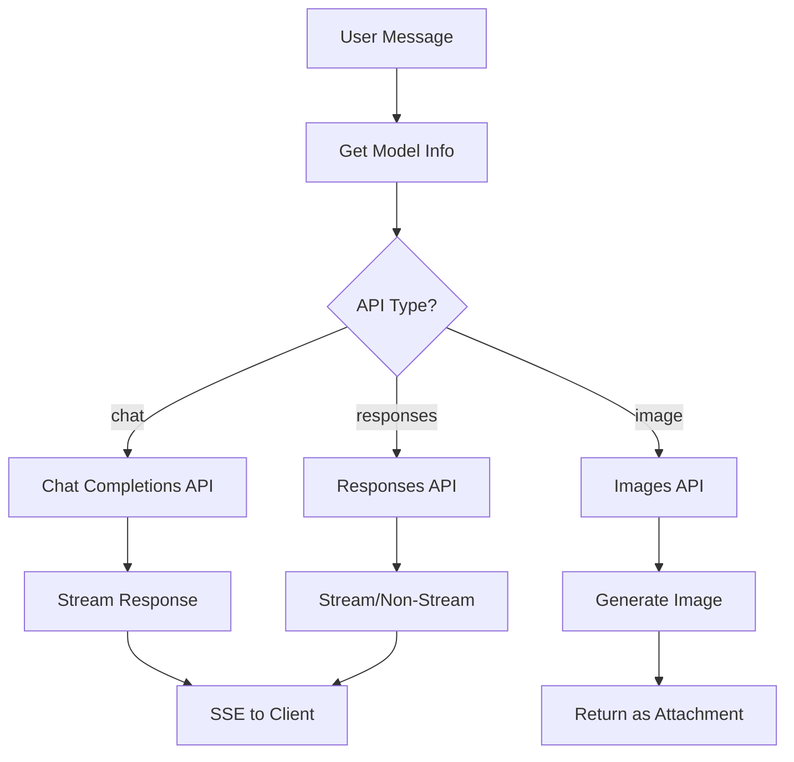
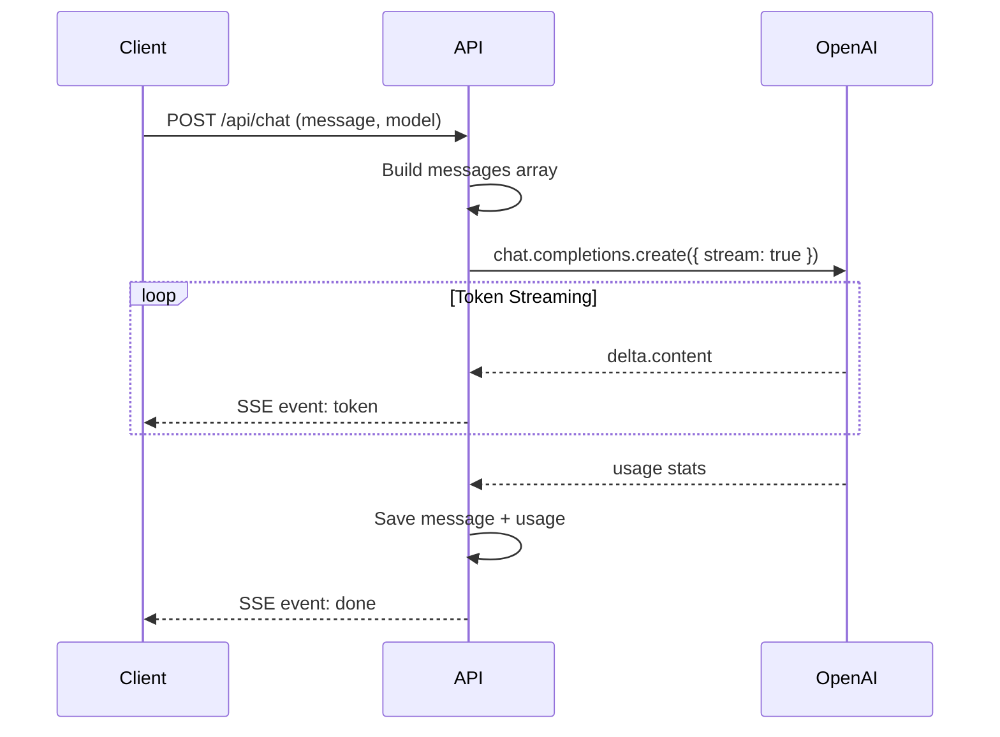
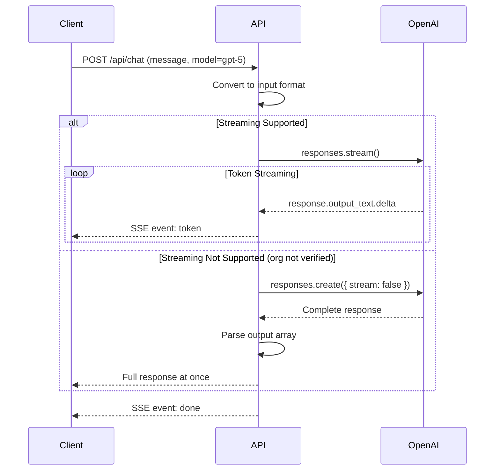
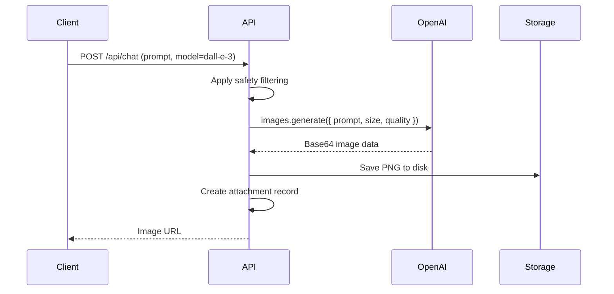

# Dual API Flow Diagrams

## Overview

The platform supports three distinct OpenAI APIs, each with different request/response patterns.

## API Selection Flow



## Chat Completions API Flow

**Used By**: GPT-4o, GPT-4o-mini, GPT-4.1, o1-mini, o1-preview, o3, o3-mini



## Responses API Flow

**Used By**: GPT-5, GPT-5-mini, GPT-5-nano



## Images API Flow

**Used By**: DALL-E 2, DALL-E 3, gpt-image-1



## Message Format Comparison

### Chat Completions API

```json
{
  "messages": [
    { "role": "system", "content": "You are helpful" },
    { "role": "user", "content": "Hello" },
    { "role": "assistant", "content": "Hi there!" }
  ]
}
```

### Responses API

```json
{
  "input": [
    { "role": "user", "content": [{ "type": "input_text", "text": "Hello" }] },
    { "role": "assistant", "content": [{ "type": "output_text", "text": "Hi!" }] }
  ]
}
```

**Key Difference**: `input_text`/`output_text` vs plain `content`

## Format Conversion

```typescript
function convertToResponsesFormat(messages) {
  return messages.map(msg => ({
    role: msg.role,
    content: [{
      type: msg.role === 'assistant' ? 'output_text' : 'input_text',
      text: msg.content
    }]
  }));
}
```

---

**See Also**:
- [API Architecture](../docs/04-api-architecture.md) - Full implementation details
- [Model Catalog](../docs/03-model-catalog.md) - Which models use which API
