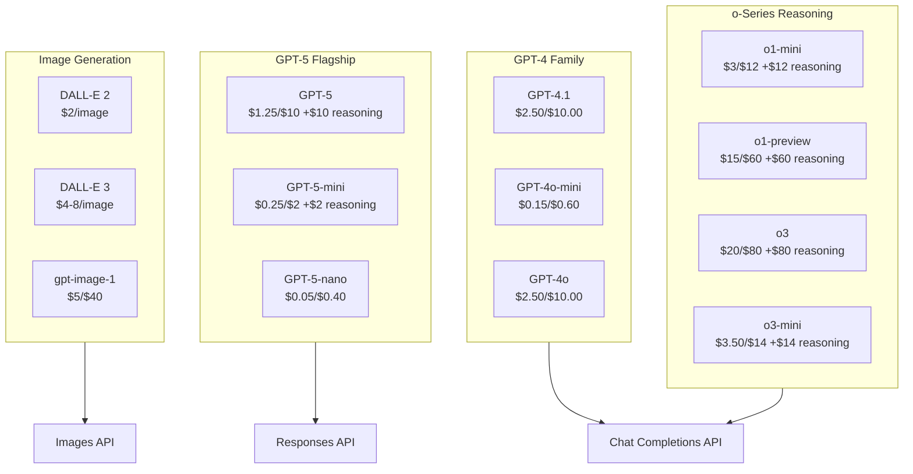
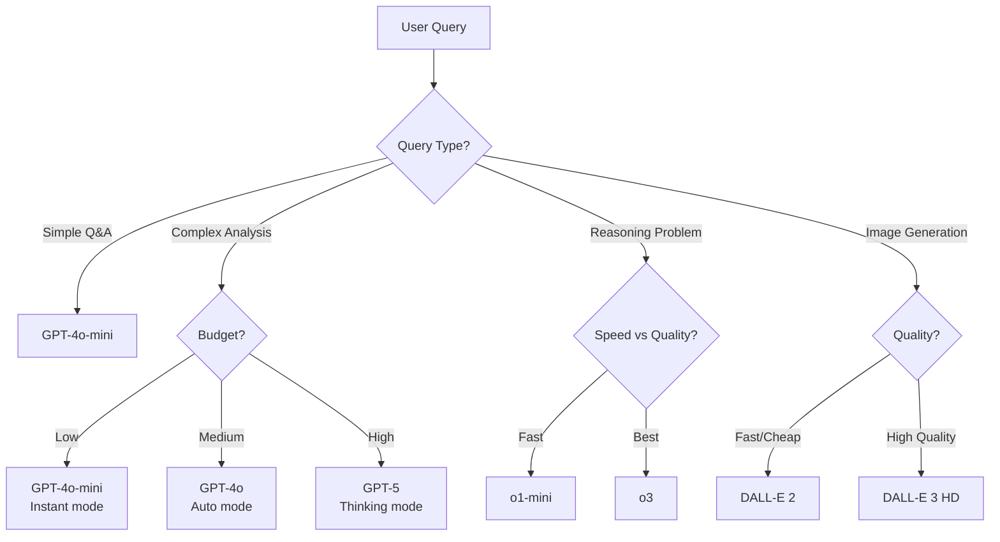

# Model Catalog Visualization

## Complete Model Overview



## Model Selection Guide



## Pricing Comparison

### Cost per 1M Tokens

| Model | Input | Output | Reasoning | Total (avg) |
|-------|-------|--------|-----------|-------------|
| GPT-4o-mini | $0.15 | $0.60 | - | ~$0.38 |
| GPT-4o | $2.50 | $10.00 | - | ~$6.25 |
| o1-mini | $3.00 | $12.00 | $12.00 | ~$9.00 |
| o3 | $20.00 | $80.00 | $80.00 | ~$60.00 |
| GPT-5 | $1.25 | $10.00 | $10.00 | ~$7.08 |
| GPT-5-nano | $0.05 | $0.40 | $0.40 | ~$0.28 |

### Relative Cost (GPT-4o-mini = 1x)

```
GPT-4o-mini  ████ 1x (baseline)
GPT-5-nano   ████ 0.7x (cheapest overall!)
GPT-4o       ████████████████ 16x
GPT-5-mini   ██████ 5x
GPT-5        ███████████████████ 19x
o1-mini      █████████████████████████ 24x
o3-mini      ██████████████████████████████ 37x
o1-preview   █████████████████████████████████████████████████████████████████████████ 158x
o3           ███████████████████████████████████████████████████████████████████████████████████████████████████████████████████████████████ 158x
```

## Mode Comparison

### Token Limits by Mode

| Mode | GPT-4o-mini | GPT-4o | GPT-5 |
|------|-------------|--------|-------|
| Instant | 1,024 | 2,048 | 16,384 |
| Auto | 2,048 | 4,096 | 32,768 |
| Thinking | 4,096 | 6,144 | 65,536 |
| Pro | 4,096 | 6,144 | 128,000 |

### Temperature by Mode

| Mode | Temperature | Use Case |
|------|-------------|----------|
| Instant | 0.35-0.4 | Quick, deterministic |
| Auto | 0.6-0.7 | Balanced |
| Thinking | 0.5-0.6 | Thorough |
| Pro | 0.2-0.3 | Precise |

---

**See Also**:
- [Model Catalog](../docs/03-model-catalog.md) - Full documentation
- [API Architecture](../docs/04-api-architecture.md) - API routing
