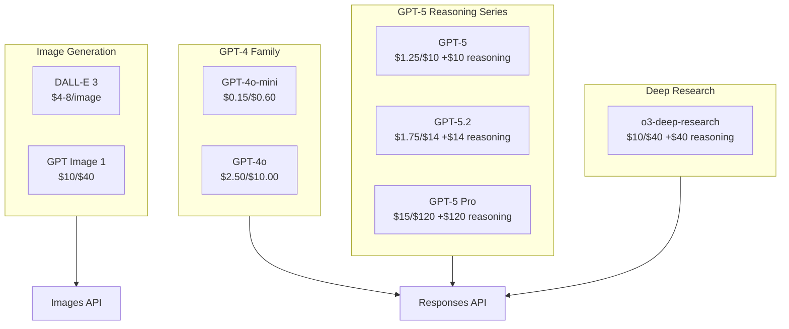
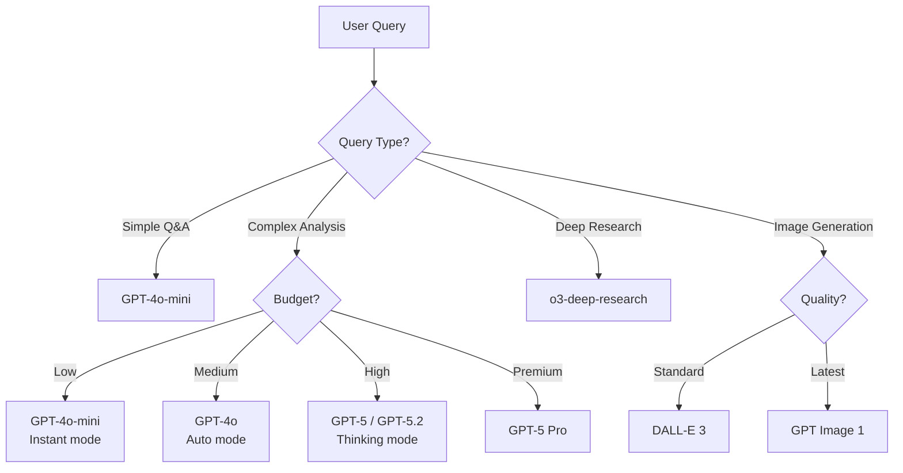

# Model Catalog Visualization

## Complete Model Overview


```mermaid
graph TB
    subgraph GPT4["GPT-4 Family"]
        4om[GPT-4o-mini<br/>$0.15/$0.60]
        4o[GPT-4o<br/>$2.50/$10.00]
    end

    subgraph GPT5["GPT-5 Reasoning Series"]
        g5[GPT-5<br/>$1.25/$10 +$10 reasoning]
        g52[GPT-5.2<br/>$1.75/$14 +$14 reasoning]
        g5p[GPT-5 Pro<br/>$15/$120 +$120 reasoning]
    end

    subgraph Research["Deep Research"]
        o3dr[o3-deep-research<br/>$10/$40 +$40 reasoning]
    end

    subgraph Image["Image Generation"]
        d3[DALL-E 3<br/>$4-8/image]
        gi[GPT Image 1<br/>$10/$40]
    end

    GPT4 --> RespAPI[Responses API]
    GPT5 --> RespAPI
    Research --> RespAPI
    Image --> ImgAPI[Images API]
```

## Model Selection Guide


```mermaid
graph TD
    Start[User Query] --> Type{Query Type?}
    
    Type -->|Simple Q&A| Simple[GPT-4o-mini]
    Type -->|Complex Analysis| Complex{Budget?}
    Type -->|Deep Research| DR[o3-deep-research]
    Type -->|Image Generation| Image{Quality?}
    
    Complex -->|Low| 4om[GPT-4o-mini<br/>Instant mode]
    Complex -->|Medium| 4o[GPT-4o<br/>Auto mode]
    Complex -->|High| g5[GPT-5 / GPT-5.2<br/>Thinking mode]
    Complex -->|Premium| g5p[GPT-5 Pro]
    
    Image -->|Standard| d3[DALL-E 3]
    Image -->|Latest| gi[GPT Image 1]
```

## Pricing Comparison

### Cost per 1M Tokens (from config.ts)

| Model | Input | Output | Reasoning | API |
|-------|-------|--------|-----------|-----|
| GPT-4o-mini | $0.15 | $0.60 | - | Responses |
| GPT-4o | $2.50 | $10.00 | - | Responses |
| GPT-5 | $1.25 | $10.00 | $10.00 | Responses |
| GPT-5.2 | $1.75 | $14.00 | $14.00 | Responses |
| GPT-5 Pro | $15.00 | $120.00 | $120.00 | Responses |
| o3-deep-research | $10.00 | $40.00 | $40.00 | Responses |
| DALL-E 3 | $4.00 | $8.00 | - | Images |
| GPT Image 1 | $10.00 | $40.00 | - | Images |

### Relative Cost (GPT-4o-mini = 1x)

```
GPT-4o-mini      ████ 1x (baseline)
GPT-4o           ████████████████ 16x
GPT-5            ███████████████████ 19x
GPT-5.2          ██████████████████████████ 26x
GPT-5 Pro        ████████████████████████████████████████████████████████████████████████████████████████████████████████████████████████████████████████ 317x
o3-deep-research ████████████████████████████████████████████████████████████████████████ 105x
```

## Mode Comparison

### Token Limits by Mode (from config.ts)

| Mode | GPT-4o-mini | GPT-4o | GPT-5 / GPT-5.2 | GPT-5 Pro |
|------|-------------|--------|------------------|-----------|
| Instant | 1,024 | 2,048 | 16,384 | - |
| Auto | 2,048 | 4,096 | 32,768 | 4,096 |
| Thinking | 4,096 | 6,144 | 65,536 | - |
| Pro | 4,096 | 6,144 | 128,000 | - |

> **Note**: GPT-5 Pro only supports Auto mode (locked to high reasoning effort). GPT-5.2 Pro mode uses `xhigh` reasoning effort.

### Temperature by Mode (GPT-4 family)

| Mode | Temperature | Use Case |
|------|-------------|----------|
| Instant | 0.35-0.4 | Quick, deterministic |
| Auto | 0.65-0.7 | Balanced |
| Thinking | 0.6 | Thorough |
| Pro | 0.2-0.3 | Precise |

> **Note**: GPT-5 family uses `reasoningEffort` and `verbosity` instead of temperature.

---

**See Also**:
- [Model Catalog](../docs/03-model-catalog.md) - Full documentation
- [API Architecture](../docs/04-api-architecture.md) - API routing
