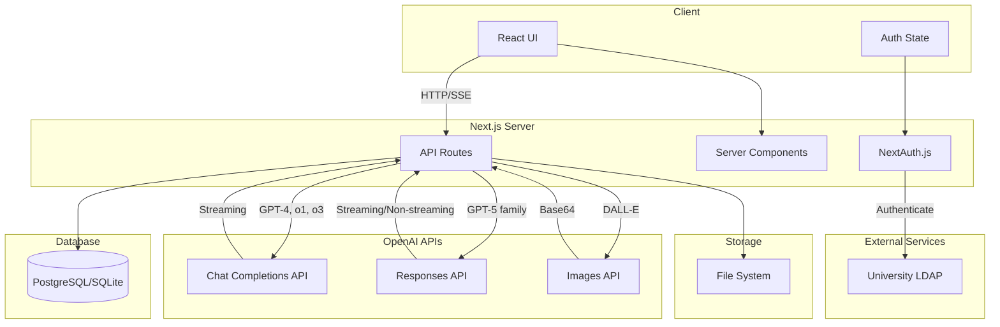
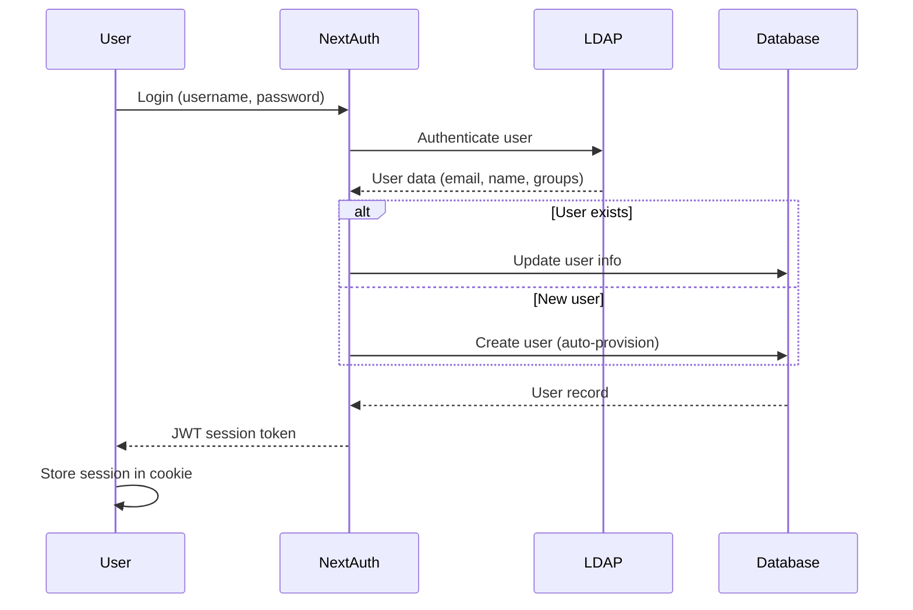
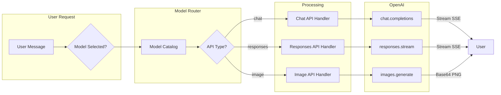
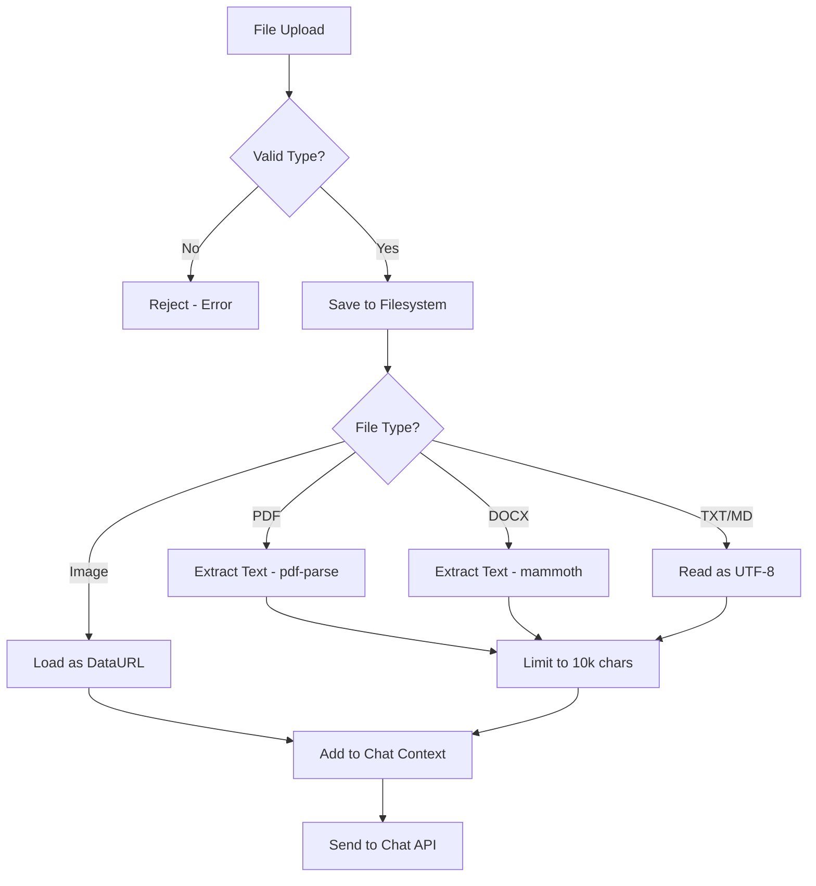
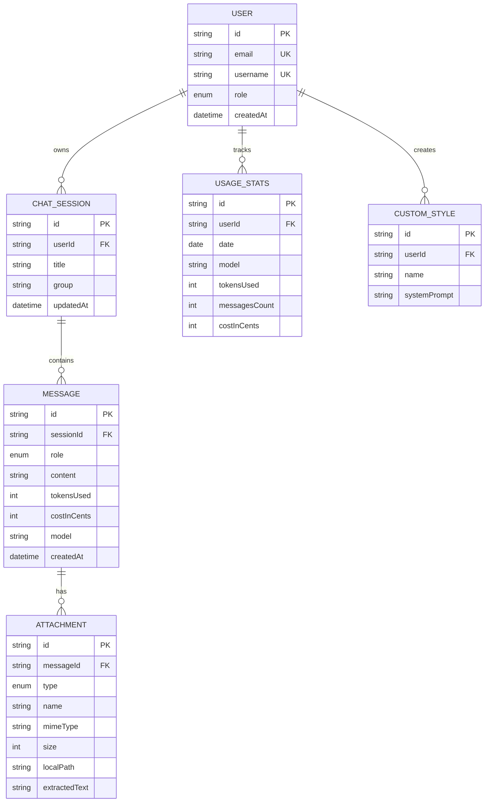
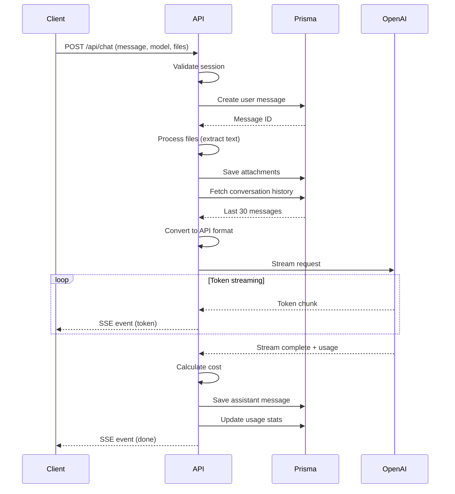
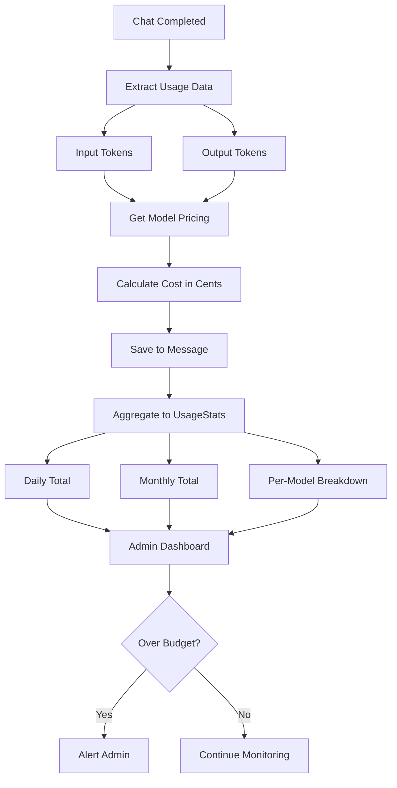
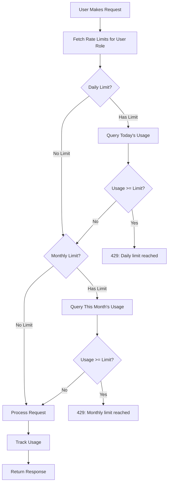
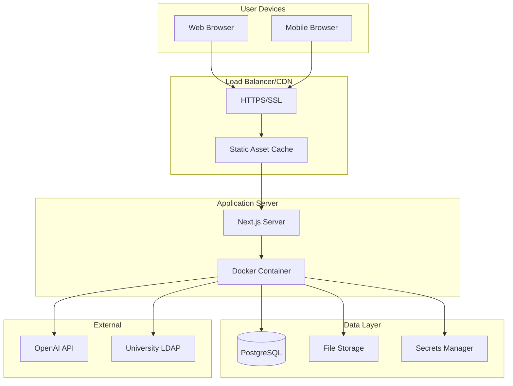
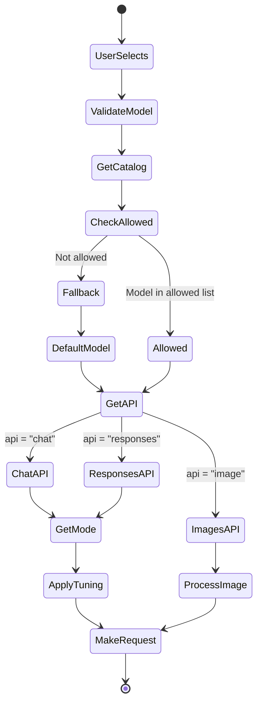

# System Architecture Diagrams

## High-Level System Flow

## Authentication Flow

## Multi-Model Chat Flow

## File Processing Pipeline

## Database Schema (ER Diagram)

## Request-Response Cycle

## Cost Tracking Flow

## Rate Limiting Logic

## Deployment Architecture

---

## Component Interactions

### Model Selection Process

---

## Key Architectural Decisions

### 1. Next.js App Router
**Decision**: Use Next.js 15 with App Router (not Pages Router)

**Rationale**:
- Server components reduce client bundle
- Built-in API routes
- TypeScript-first
- SSR+CSR flexibility

### 2. Prisma ORM
**Decision**: Prisma with SQLite (dev) → PostgreSQL (prod)

**Rationale**:
- Type-safe database access
- Easy migrations
- Auto-generated types
- Good DX (schema.prisma)

### 3. LDAP Authentication
**Decision**: Integrate with university Active Directory

**Rationale**:
- No user management needed
- Reuse existing credentials
- Auto-provisioning
- Single sign-on experience

### 4. Database-Driven Rate Limiting
**Decision**: Store limits in database, not Redis

**Rationale**:
- Simpler deployment (no Redis needed)
- Adequate for 60-user pilot
- Easy admin changes (update DB row)
- Migrate to Redis if scaling to 1000+ users

### 5. Server-Side File Storage
**Decision**: Local filesystem, not S3/Cloud Storage

**Rationale**:
- Simpler for pilot (no cloud config)
- Lower latency for file access
- Easy migration to cloud later
- Adequate for moderate usage

---

**See Also**:
- [API Architecture](../docs/04-api-architecture.md) - Detailed API integration
- [Security & Compliance](../docs/09-security-compliance.md) - Production deployment
- [Code Examples](../code-examples/) - Implementation details
