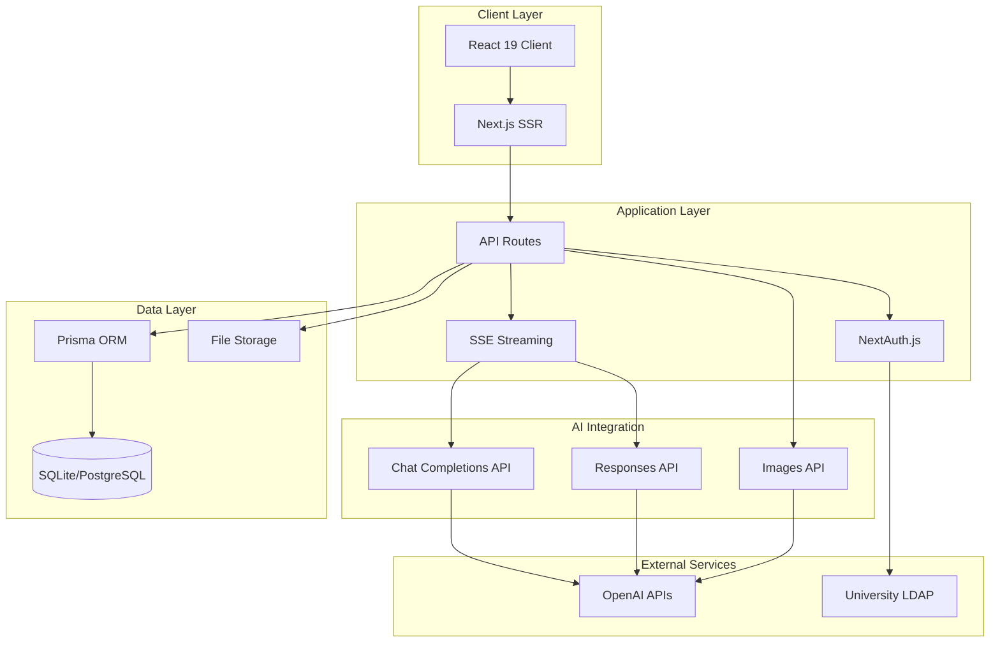

# Technical Architecture

## System Overview

Enterprise multi-model AI chat platform built with modern web technologies and production-grade patterns.

## High-Level Architecture

## Tech Stack

### Frontend
| Technology | Version | Purpose |
|------------|---------|---------|
| Next.js | 15.5.4 | React framework with App Router |
| React | 19.1.0 | UI components with Server Components |
| TypeScript | 5.x | Type safety throughout |
| Tailwind CSS | 4.x | Utility-first styling |
| Framer Motion | - | Animations and transitions |
| React Markdown | - | Chat message rendering |

### Backend
| Technology | Version | Purpose |
|------------|---------|---------|
| Next.js API Routes | 15.5.4 | Serverless API handlers |
| Prisma | 6.16.x | Type-safe ORM |
| NextAuth.js | - | Authentication |
| OpenAI SDK | 5.23.x | AI model integration |

### Database Schema

6 Prisma models with relationships:

1. **User**: Authentication and profile
2. **ChatSession**: Conversation containers
3. **Message**: Individual messages with metadata
4. **Attachment**: File uploads per message
5. **UsageStats**: Per-user, per-model, per-day tracking
6. **CustomStyle**: User-created system prompts
7. **ModelRateLimit**: Per-role token limits

### Key Architectural Decisions

1. **App Router over Pages Router**: Server Components reduce bundle size
2. **SQLite → PostgreSQL**: Easy development, production-ready migration path
3. **Dual API Architecture**: Support both Chat and Responses APIs for different models
4. **Database Rate Limiting**: No Redis dependency for pilot (scales to Redis if needed)
5. **Server-Side File Storage**: Simple deployment, can migrate to S3/Cloud Storage

---

**See Also**:
- [System Architecture Diagrams](../diagrams/system-architecture.md)
- [API Architecture](04-api-architecture.md)
- [Database Schema](../diagrams/database-schema.md)
