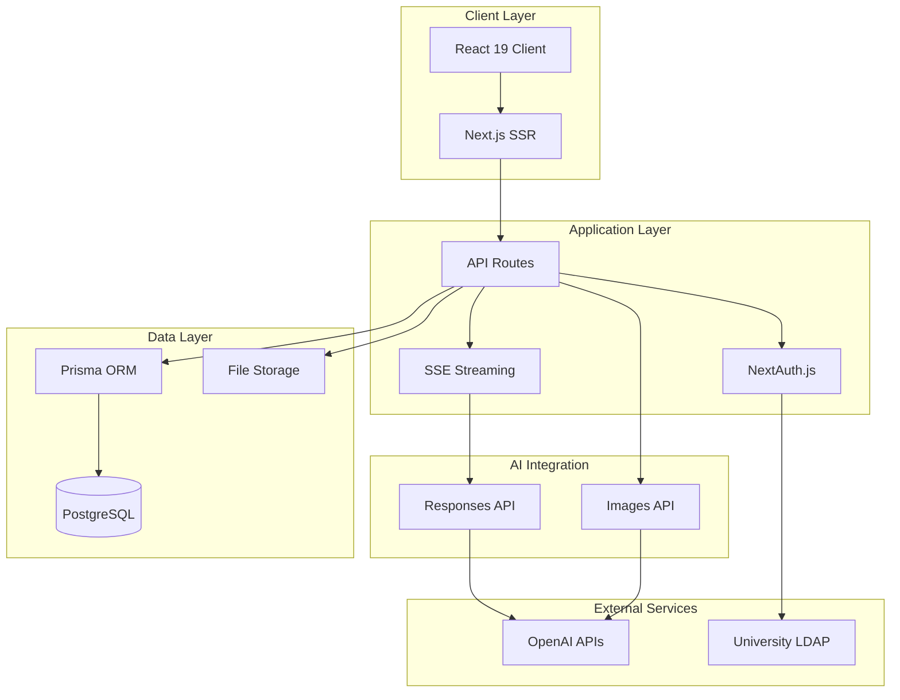

# Technical Architecture

## System Overview

Enterprise multi-model AI chat platform built with modern web technologies and production-grade patterns. Deployed on SAMK University infrastructure via Docker.

## High-Level Architecture

```mermaid
graph TB
    subgraph "Client Layer"
        Browser[React 19 Client]
        SSR[Next.js SSR]
    end

    subgraph "Application Layer"
        API[API Routes]
        Auth[NextAuth.js]
        Stream[SSE Streaming]
    end

    subgraph "AI Integration"
        RespAPI[Responses API]
        ImgAPI[Images API]
    end

    subgraph "Data Layer"
        Prisma[Prisma ORM]
        DB[(PostgreSQL)]
        Files[File Storage]
    end

    subgraph "External Services"
        OpenAI[OpenAI APIs]
        LDAP[University LDAP]
    end

    Browser --> SSR
    SSR --> API
    API --> Auth
    Auth --> LDAP
    
    API --> Stream
    Stream --> RespAPI
    API --> ImgAPI
    
    RespAPI --> OpenAI
    ImgAPI --> OpenAI
    
    API --> Prisma
    Prisma --> DB
    API --> Files
```

## Tech Stack

### Frontend
| Technology | Version | Purpose |
|------------|---------|---------|
| Next.js | 15.1.7 | React framework with App Router |
| React | 19.1.0 | UI components with Server Components |
| TypeScript | 5.x | Type safety throughout |
| Tailwind CSS | 4.x | Utility-first styling |
| Framer Motion | 12.x | Animations and transitions |
| React Markdown | 10.x | Chat message rendering |
| KaTeX | 0.16.x | Math equation rendering |

### Backend
| Technology | Version | Purpose |
|------------|---------|---------|
| Next.js API Routes | 15.1.7 | Serverless API handlers |
| Prisma | 6.16.x | Type-safe ORM |
| NextAuth.js | 4.24.x | Authentication |
| OpenAI SDK | 5.23.x | AI model integration |
| ldapts | 8.1.x | LDAP/AD authentication |

### Database Schema

10 Prisma models:

1. **User**: Authentication and profile (LDAP-synced)
2. **ChatSession**: Conversation containers with group labels
3. **Message**: Individual messages with encryption fields (`iv`, `reasoningText`, `reasoningIv`)
4. **Attachment**: File uploads per message (images, documents)
5. **UsageStats**: Per-user, per-model, per-day tracking
6. **CustomStyle**: User-created persistent system prompts
7. **ModelGroup**: Logical model collections with monthly budget caps
8. **UserModelAccess**: Per-user or per-role access overrides for model groups
9. **UserAccessList**: Hard whitelist/blacklist by email
10. **SystemSetting**: Dynamic application configuration key-value store

### Key Architectural Decisions

1. **App Router over Pages Router**: Server Components reduce bundle size
2. **PostgreSQL via Docker**: Production database with Prisma ORM
3. **Responses API for all chat models**: Unified API routing (GPT-4o-mini/GPT-4o also use Responses API)
4. **Dynamic Model Groups**: Decouple user access from hardcoded model strings
5. **Encryption at Rest**: Dual-IV scheme for message content and reasoning text (GDPR)

---

**See Also**:
- [System Architecture Diagrams](../diagrams/system-architecture.md)
- [API Architecture](04-api-architecture.md)
- [Database Schema](../diagrams/database-schema.md)
