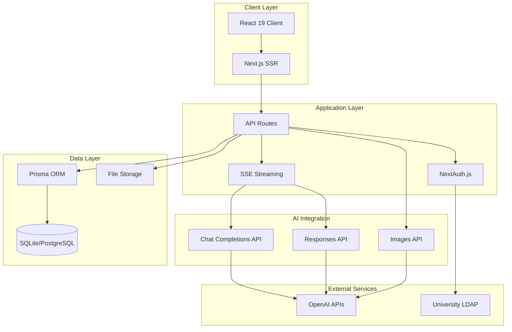

# Technical Architecture

## System Overview

Enterprise multi-model AI chat platform built with modern web technologies and production-grade patterns.

## High-Level Architecture

```mermaid
graph TB
    subgraph "Client Layer"
        Browser[React 19 Client]
        SSR[Next.js SSR]
    end

    subgraph "Application Layer"
        API[API Routes]
        Auth[NextAuth.js]
        Stream[SSE Streaming]
    end

    subgraph "AI Integration"
        ChatAPI[Chat Completions API]
        RespAPI[Responses API]
        ImgAPI[Images API]
    end

    subgraph "Data Layer"
        Prisma[Prisma ORM]
        DB[(SQLite/PostgreSQL)]
        Files[File Storage]
    end

    subgraph "External Services"
        OpenAI[OpenAI APIs]
        LDAP[University LDAP]
    end

    Browser --> SSR
    SSR --> API
    API --> Auth
    Auth --> LDAP
    
    API --> Stream
    Stream --> ChatAPI
    Stream --> RespAPI
    API --> ImgAPI
    
    ChatAPI --> OpenAI
    RespAPI --> OpenAI
    ImgAPI --> OpenAI
    
    API --> Prisma
    Prisma --> DB
    API --> Files
```

## Tech Stack

### Frontend
| Technology | Version | Purpose |
|------------|---------|---------|
| Next.js | 15.5.4 | React framework with App Router |
| React | 19.1.0 | UI components with Server Components |
| TypeScript | 5.x | Type safety throughout |
| Tailwind CSS | 4.x | Utility-first styling |
| Framer Motion | - | Animations and transitions |
| React Markdown | - | Chat message rendering |

### Backend
| Technology | Version | Purpose |
|------------|---------|---------|
| Next.js API Routes | 15.5.4 | Serverless API handlers |
| Prisma | 6.16.x | Type-safe ORM |
| NextAuth.js | - | Authentication |
| OpenAI SDK | 5.23.x | AI model integration |

### Database Schema

10 Prisma models dynamically handling routing and security:

1. **User**: Authentication and profile
2. **ChatSession**: Conversation containers
3. **Message**: Individual messages with metadata, token usages, and GDPR-compliant `iv` / `reasoningIv` encryption boundaries
4. **Attachment**: File uploads per message
5. **UsageStats**: Per-user, per-model, per-day tracking
6. **CustomStyle**: User-created persistent system prompts
7. **ModelGroup**: Logical collections of models with group-wide budgets
8. **UserModelAccess**: Precise overrides for a user to access a specific ModelGroup
9. **UserAccessList**: Global Blacklist/Whitelist state control
10. **SystemSetting**: Dynamic application configuration

### Key Architectural Decisions

1. **App Router over Pages Router**: Server Components reduce bundle size
2. **SQLite → PostgreSQL**: Enabled concurrency and reliable relation tracking
3. **Dual API Architecture**: Support both Chat and Responses APIs, seamlessly merging citations and tool outputs
4. **Dynamic Model Routing**: ModelGroups decouple users from specific model strings, avoiding Redis limits dependency
5. **Encryption at Rest**: Messages rely on a dual-IV algorithm providing GDPR-Right to Erasure through Key drops

---

**See Also**:
- [System Architecture Diagrams](../diagrams/system-architecture.md)
- [API Architecture](04-api-architecture.md)
- [Database Schema](../diagrams/database-schema.md)
