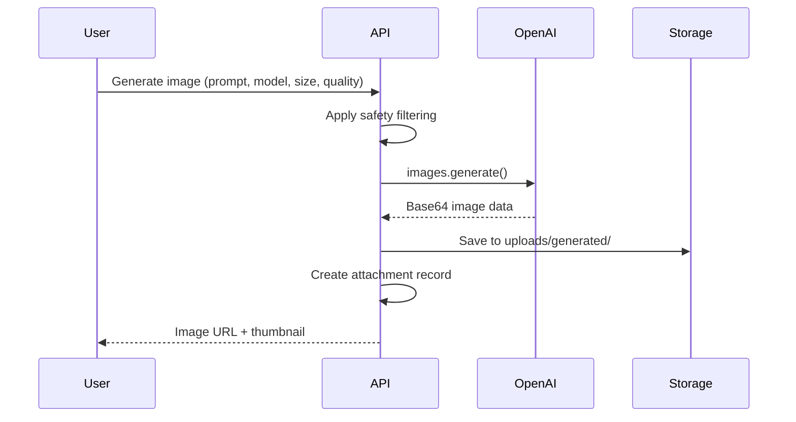

# Image Generation

## Overview

Fully integrated image generation supporting 3 OpenAI models with safety filtering, quality controls, and server-side storage.

## Supported Models

| Model | Pricing | Best For |
|-------|---------|----------|
| **DALL-E 2** | $2.00/image | Fast, cost-effective iterations |
| **DALL-E 3** | $4.00-8.00/image | High-quality, detailed images |
| **gpt-image-1** | $5.00 in / $40.00 out | Latest generation |

## Size Options

| Model | Available Sizes |
|-------|-----------------|
| DALL-E 2 | 256x256, 512x512, 1024x1024 |
| DALL-E 3 | 1024x1024, 1024x1536 (portrait), 1536x1024 (landscape) |
| gpt-image-1 | Model default |

## Quality Levels

- **Low**: Standard quality, faster generation
- **Medium**: Balanced (default)
- **High**: HD quality (DALL-E 3 only, maps to `hd` parameter)

## Safety Filtering

Automatic content policy compliance for DALL-E 3:

```typescript
// Automatic prompt safety rewrites
prompt = prompt
  .replace(/\b(baby|infant|child|toddler)\b/gi, "young adult")
  .replace(/\b(nude|naked|sexual|explicit)\b/gi, "artistic")
  .replace(/\b(violence|violent|blood|gore)\b/gi, "dramatic");
```

## Implementation Flow



## Server-Side Storage

Generated images are stored locally:
- **Path**: `uploads/generated/{timestamp}_{uuid}.png`
- **Format**: PNG (base64 decoded)
- **Database**: Attachment record with `type: 'generated_image'`
- **Cleanup**: Manual or scheduled deletion

## Response Format

Images are returned as chat attachments:

```typescript
{
  type: 'generated_image',
  name: 'generated_1702665432_abc123.png',
  mimeType: 'image/png',
  size: 1048576,
  localPath: '/uploads/generated/...',
  url: '/api/attachments/...'
}
```

## Usage in Chat

1. User selects image model (DALL-E 2/3 or gpt-image-1)
2. Types prompt describing desired image
3. Optionally selects size and quality
4. Submits message
5. Image generates and appears in chat
6. Can download or copy image

---

**See Also**:
- [Model Catalog](03-model-catalog.md) - Full pricing details
- [API Architecture](04-api-architecture.md) - Images API integration
