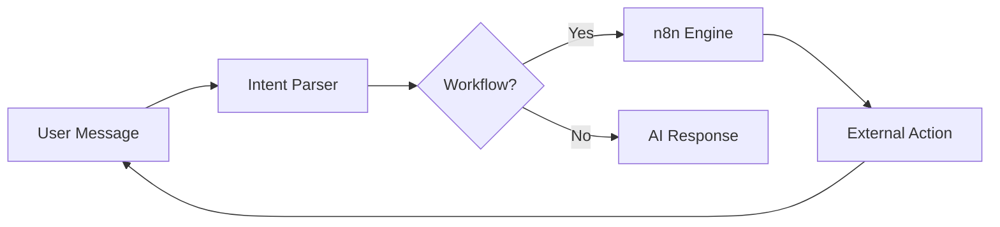

# Future Roadmap

## Planned Enhancements

### Phase 1: Pilot Feedback Resolution (Est. ~20 hours)

**Priority**: Current Focus

| Task | Hours | Status |
|------|-------|--------|
| UI Metric Tracking Tweaks | 4-8 | Planned |
| Hardware GPU scaling checks | 2-4 | Planned |
| Workflow integrations (Basic) | 4-6 | Planned |
| Session logic fine-tuning | 1-2 | Planned |
| Complete legal approvals | 4-6 | Ongoing |

---

### Phase 2: n8n Workflow Automation (Est. 60-92 hours)

**Priority**: Medium

Integrate n8n workflow engine for automated tasks from chat.

**Features**:
- Trigger workflows from natural language
- Pre-built templates (email, calendar, Moodle)
- Custom workflow creation by admins
- Shareable agent marketplace

**Use Cases**:
- "Schedule a meeting with my team for next Tuesday"
- "Send this document to the review committee"
- "Check my upcoming deadlines in Moodle"

**Architecture**:

```mermaid
graph LR
    User[User Message] --> Parse[Intent Parser]
    Parse --> Router{Workflow?}
    Router -->|Yes| n8n[n8n Engine]
    Router -->|No| AI[AI Response]
    n8n --> Action[External Action]
    Action --> User
```

---

### Phase 3: Moodle LMS Integration (Est. 42-64 hours)

**Priority**: Medium

Connect to university Moodle for educational features.

**Features**:
- Course lookup and enrollment info
- Assignment tracking and deadlines
- Grade checking (read-only)
- Resource recommendations
- Real-time data sync

**Example Interactions**:
- "What assignments are due this week?"
- "Show my grades for Data Science course"
- "Find resources about machine learning"

---

### Phase 4: Enhanced Security (Est. 42-60 hours)

**Priority**: High after production

| Feature | Hours | Description |
|---------|-------|-------------|
| IP rate limiting | 8-12 | DDoS protection |
| Audit logging | 12-16 | Complete action trail |
| Cost alerts | 6-10 | Budget notifications |
| Anomaly detection | 16-22 | Abuse pattern detection |

---

### Phase 5: Advanced Features (Est. 100+ hours)

**Priority**: Future

- **Multi-language UI**: Finnish, Swedish, English
- **Mobile app**: React Native companion
- **Advanced analytics**: Usage patterns, recommendations
- **Model routing**: Automatic selection based on query
- **Caching**: Reduce API costs for common queries
- **Voice input**: Speech-to-text integration
- **Dedicated Hardware Proxies**: SAMK specific self-hosted local open-source models (DeepSeek R1 / SAMK Qwen)

---

## Not Planned

Features considered but deprioritized:

- Real-time multiplayer collaboration (out of scope)
- Video generation pipelines (limited institutional use case)
- Full custom fine-tuning pipelines (maintenance burden)

---

**See Also**:
- [Security & Compliance](09-security-compliance.md) - Current gaps
- [Enterprise Features](06-enterprise-features.md) - Existing capabilities
- [Executive Summary](01-executive-summary.md) - Business context
